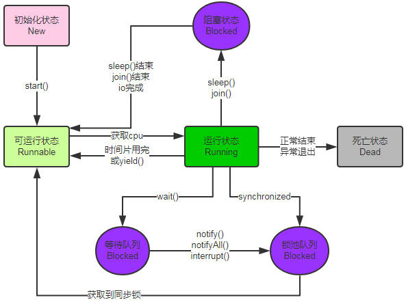

# 背景
在日常的开发中，我们有些业务单据有非常复杂流程（它有很多状态），如果靠传统的全局属性然后通过swich和if来判断的话，扩展性差，重复代码多。通过编写一个状态管理库来解决状态变化的优点有：
- 	代码整洁，可读性强
- 	易拓展，可复用
- 	维护成本小

# 有限状态机
有限状态机（Finite-state machine, FSM），又称有限状态自动机，简称状态机，是表示有限个状态以及在这些状态之间的转移和动作等行为的数学模型。
<br/>

<br/>
- State：状态。一个标准的状态机最少包含两个状态：初始和终态。初态是状态机初始化后所处的状态，而终态顾名思义就是状态机结束时所处的状态。其他的状态都是一些流转中停留的状态。标准的状态机还会涉及到一些中间态，存在中间态的状态机流程就会比较复杂（用处也不是特别大，而且可以通过其他方式实现），所以在目标实现的状态机里不会引入这个概念。
- Event：事件。还有中描述叫Trigger，表达的意思都一样，就是要执行某个操作的触发器或口令：当状态机处于某个状态时，只有外界告诉状态机要干什么事情的时候，状态机才会去执行具体的行为，来完成外界想要它完成的操作。比如出去吃饭，说“点菜”，服务员才会拿着小本过来记录你要吃的菜，说的那句“点菜”，就相当于Event。
- Action：行为。状态变更索要执行的具体行为。还是拿上面点菜的例子，服务员拿小本记录你定的菜的过程就是Action
- Transition：流转。一个状态接收一个事件执行了某些行为到达了另外一个状态的过程就是一个Transition。定义Transition就是在定义状态机的运转流程。

# 项目实践
## 项目结构设计
```html
│  │  com
│  │  └─github
│  │      └─middleware
│  │          └─fsm
│  │              ├─builder				构建状态机，依赖core,excption,filter,config
│  │              │  ├─chain
│  │              │  │  ├─dto
│  │              │  │  └─support
│  │              │  ├─event
│  │              │  │  ├─annotation
│  │              │  │  ├─dto
│  │              │  │  └─support
│  │              │  ├─exec
│  │              │  │  ├─annotation
│  │              │  │  ├─dto
│  │              │  │  └─support
│  │              │  ├─machine
│  │              │  │  ├─annotation
│  │              │  │  ├─dto
│  │              │  │  ├─factroy
│  │              │  │  └─support
│  │              │  │      └─visit
│  │              │  ├─plugin
│  │              │  │  ├─log
│  │              │  │  │  └─support
│  │              │  │  └─support
│  │              │  ├─selector
│  │              │  └─state
│  │              │      ├─dto
│  │              │      └─support
│  │              │          └─visit
│  │              ├─config					所有配置项，依赖core,filter,exception
│  │              │  ├─annotation
│  │              │  ├─application
│  │              │  └─loader
│  │              │      └─support
│  │              ├─core					基础模块，仅依赖exception
│  │              │  ├─convert
│  │              │  │  └─support
│  │              │  ├─el
│  │              │  │  └─support
│  │              │  ├─extension
│  │              │  │  └─support
│  │              │  ├─factory
│  │              │  ├─types
│  │              │  └─utils
│  │              ├─exception				异常处理模块，不依赖任何模块
│  │              ├─filter					包含校验，后置处理，依赖core,filter,exception
│  │              │  ├─annotation
│  │              │  ├─validator
│  │              │  │  └─support
│  │              │  └─wrapper
│  │              │      └─support
│  │              └─spring					集成spring
│  │                  └─annotation
```

## 设计编码须知
    1.健壮性（异常处理、灵活没打算依赖spring）           见TODO（持续进行中）
    2.安全性（封装级别、客户端访问、侵入性）             见TODO（持续进行中）
    3.拓展性(可插拔、多变功能柔性设计)                   见TODO（持续进行中）

## 代办功能事宜
    Step：链式语法设计                                  √
    Step：添加mvel表达式支持                            √
    Step：大量反射的优化及同异步Action                  √（持续进行中）
    Step：添加注解支持及枚举的兼容性                    √
    Step：客户端那么多泛型好麻烦，优化客户端入口        √
    Step：支持客户端更多后置处理                        √
    Step：支持客户端拓展参数支持,前置处理               √
    Step：添加action,transition的事件支持及多线程驱动    √
    Step：插件化支持(Log记录状态机所有操作...)             √
    Step：parent state支持，transition的正则匹配          √
    Step：还需要支持XML?Antrl?                             ×
    Step：更多执行策略支持                                 ×
    Step：DependProvider替换SPI的开展                      ×
    Step：关于版本化（设计考虑点）                         ×
    Step：.....

## 验收方面
    1.后续编写单元测试
    2.OMS/kos/TMS安排开发进行了解及接入

## 交付
    计划2017/5/1使用
# 快速开始
## 非spring环境（半自动化）
为啥叫半自动化呢，它的运行环境确实不是在spring环境下，你需要自己实例化
```java
public class QuickStart_test {
    /***
     * 第一步：定义状态机扭转
     */
    @States({
            @State(name = "A", isInitial = true),
            @State(name = "A1", entryMethod = "enterA1", exitMethod = "exitA1"),
            @State(name = "A2", entryMethod = "enterA2", exitMethod = "exitA2"),
            @State(name = "A3", entryMethod = "enterA3", exitMethod = "exitA3"),
            @State(name = "A4", entryMethod = "enterA4", exitMethod = "exitA4"),
            @State(name = "A4a", parent = "A4", entryMethod = "enterA4a", exitMethod = "exitA5a", isEnd = true)
    })
    @Transitions({
            @Transition(from = "A", to = "A1", on = "ATA1", complete = "fromAToA1", whenMVEL = "PriceChecker::context.price>0&&context.price<100000"),
            @Transition(from = "A1", to = "A2", on = "A1TA2", complete = "fromA1ToA2"),
            @Transition(from = "A2", to = "A3", on = "A2TA3", complete = "fromA2ToA3"),
            @Transition(from = "A3", to = "A4", on = "A3TA4", complete = "fromA3ToA4")
    })
    interface OrderStateMachine extends StateMachine<OrderStateMachine, OrderState, OrderEvent, Order> {
        // entry states
        void enterA1(OrderState from, OrderState to, OrderEvent event, Order context);

        void enterA2(OrderState from, OrderState to, OrderEvent event, Order context);

        void enterA3(OrderState from, OrderState to, OrderEvent event, Order context);

        void enterA4(OrderState from, OrderState to, OrderEvent event, Order context);

        void enterA4a(OrderState from, OrderState to, OrderEvent event, Order context);

        // transitions
        void fromAToA1(OrderState from, OrderState to, OrderEvent event, Order context);

        void fromA1ToA2(OrderState from, OrderState to, OrderEvent event, Order context);

        void fromA2ToA3(OrderState from, OrderState to, OrderEvent event, Order context);

        void fromA3ToA4(OrderState from, OrderState to, OrderEvent event, Order context);

        // exit states
        void exitA1(OrderState from, OrderState to, OrderEvent event, Order context);

        void exitA2(OrderState from, OrderState to, OrderEvent event, Order context);

        void exitA3(OrderState from, OrderState to, OrderEvent event, Order context);

        void exitA4(OrderState from, OrderState to, OrderEvent event, Order context);

        void beforeTransitionBegin(OrderState from, OrderEvent event, Order context);

        void afterTransitionCompleted(OrderState from, OrderState to, OrderEvent event, Order context);

        void afterTransitionDeclined(OrderState from, OrderEvent event, Order context);

        void afterTransitionCausedException(OrderState fromState, OrderState toState, OrderEvent event, Order context);

    }

    /***
     * 第二步：每个扭转的内嵌实现
     */
    public static class OrderStateMachineImpl extends AbstractStateMachine<OrderStateMachine, OrderState, OrderEvent, Order> implements OrderStateMachine {
        private String name;

        public String getName() {
            return name;
        }

        public void setName(String name) {
            this.name = name;
        }

        @LogExec
        @Override
        public void enterA1(OrderState from, OrderState to, OrderEvent event, Order context) {
            System.out.println("当前执行方法：" + Thread.currentThread().getStackTrace()[1].getMethodName());
        }

        @Override
        public void enterA2(OrderState from, OrderState to, OrderEvent event, Order context) {
            System.out.println("当前执行方法：" + Thread.currentThread().getStackTrace()[1].getMethodName());
        }

        @Override
        public void enterA3(OrderState from, OrderState to, OrderEvent event, Order context) {
            System.out.println("当前执行方法：" + Thread.currentThread().getStackTrace()[1].getMethodName());
        }

        @Override
        public void enterA4(OrderState from, OrderState to, OrderEvent event, Order context) {
            System.out.println("当前执行方法：" + Thread.currentThread().getStackTrace()[1].getMethodName());
        }

        @Override
        public void enterA4a(OrderState from, OrderState to, OrderEvent event, Order context) {
            System.out.println("当前执行方法：" + Thread.currentThread().getStackTrace()[1].getMethodName());
        }

        @Override
        public void fromAToA1(OrderState from, OrderState to, OrderEvent event, Order context) {
            System.out.println("当前执行方法：" + Thread.currentThread().getStackTrace()[1].getMethodName());
        }

        @Override
        public void fromA1ToA2(OrderState from, OrderState to, OrderEvent event, Order context) {
            System.out.println("当前执行方法：" + Thread.currentThread().getStackTrace()[1].getMethodName());
        }

        @Override
        public void fromA2ToA3(OrderState from, OrderState to, OrderEvent event, Order context) {
            System.out.println(this.name);
            System.out.println("当前执行方法：" + Thread.currentThread().getStackTrace()[1].getMethodName());
        }

        @Override
        public void fromA3ToA4(OrderState from, OrderState to, OrderEvent event, Order context) {
            System.out.println("当前执行方法：" + Thread.currentThread().getStackTrace()[1].getMethodName());
        }

        @Override
        public void exitA1(OrderState from, OrderState to, OrderEvent event, Order context) {
            System.out.println("当前执行方法：" + Thread.currentThread().getStackTrace()[1].getMethodName());
        }

        @Override
        public void exitA2(OrderState from, OrderState to, OrderEvent event, Order context) {
            System.out.println("当前执行方法：" + Thread.currentThread().getStackTrace()[1].getMethodName());
        }

        @Override
        public void exitA3(OrderState from, OrderState to, OrderEvent event, Order context) {
            System.out.println("当前执行方法：" + Thread.currentThread().getStackTrace()[1].getMethodName());
        }

        @Override
        public void exitA4(OrderState from, OrderState to, OrderEvent event, Order context) {
            System.out.println("当前执行方法：" + Thread.currentThread().getStackTrace()[1].getMethodName());
        }

        @Override
        public void beforeTransitionBegin(OrderState from, OrderEvent event, Order context) {
            //order do
            System.out.println("当前执行方法：" + Thread.currentThread().getStackTrace()[1].getMethodName());
            super.beforeTransitionBegin(from, event, context);
        }

        @Override
        public void afterTransitionCompleted(OrderState from, OrderState to, OrderEvent event, Order context) {
            //order do
            System.out.println("当前执行方法：" + Thread.currentThread().getStackTrace()[1].getMethodName());
            super.afterTransitionCompleted(from, to, event, context);
        }

        @Override
        public void afterTransitionDeclined(OrderState from, OrderEvent event, Order context) {
            //order do
            System.out.println("当前执行方法：" + Thread.currentThread().getStackTrace()[1].getMethodName());
            super.afterTransitionDeclined(from, event, context);
        }

        @Override
        public void afterTransitionCausedException(OrderState fromState, OrderState toState, OrderEvent event, Order context) {
            //order do
            System.out.println("当前执行方法：" + Thread.currentThread().getStackTrace()[1].getMethodName());
            super.afterTransitionCausedException(fromState, toState, event, context);
        }
    }

    private StateMachineBuilder<OrderStateMachine, OrderState, OrderEvent, Order> builder;
    private OrderStateMachine stateMachine;
    private Stopwatch stopwatch;

    /**
     * 第三步（上）:定义StateMachineBuilderFactory
     */
    @Before
    public void beforeMethod() {
        builder = StateMachineBuilderFactory.create(OrderStateMachineImpl.class, OrderState.class, OrderEvent.class, Order.class);
        builder.newPluginBuilder(new FsmListenerLogger()).install();
        stopwatch = Stopwatch.createStarted();
    }

    @Test
    public void go_handleEvent() {
        Stopwatch stopwatch = Stopwatch.createStarted();
        Order order = new Order() {{
            setId(1);
            setName("xiaomi5");
            setPrice(new BigDecimal(1));
            //setPrice(new BigDecimal(100000));
        }};
        /**
         * 第三步（下）:实例化一个stateMachine
         */
        stateMachine = builder.newStateMachine(OrderState.A, new StateMachineConfig().setEnableEventListener(true));
        stateMachine.handleEvent(OrderEvent.ATA1, order);
        System.out.println("times:" + stopwatch);
        Assert.assertTrue(stateMachine.getCurrentState() == OrderState.A1);
    }

    @Test
    public void go_handleEvent_useBean() {
        Stopwatch stopwatch = Stopwatch.createStarted();
        Order order = new Order() {{
            setId(1);
            setName("xiaomi5");
            setPrice(new BigDecimal(1));
            //setPrice(new BigDecimal(100000));
        }};
        OrderStateMachineImpl beanInstance = new OrderStateMachineImpl();
        beanInstance.setName("a");
        stateMachine = builder.newStateMachine(beanInstance, OrderState.A, new StateMachineConfig().setEnableEventListener(true));
        stateMachine.handleEvent(OrderState.A2, OrderEvent.A2TA3, order);
        System.out.println(beanInstance == stateMachine);
        Assert.assertTrue(stateMachine.getCurrentState() == OrderState.A3);
    }

    @Test
    public void go_handleEvent_plugin() {
        Order order = new Order() {{
            setId(1);
            setName("xiaomi5");
            setPrice(new BigDecimal(1));
            //setPrice(new BigDecimal(100000));
        }};
        PostProcessor<OrderStateMachine> pluginPostProceesor = (m) -> {
            m.pluginsStart();
        };
        PostProcessorProvider.getInstance().register(OrderStateMachine.class, pluginPostProceesor);

        stateMachine = builder.newStateMachine(OrderState.A, new StateMachineConfig().setEnableEventListener(true));
        stateMachine.handleEvent(OrderEvent.ATA1, order);
        Assert.assertTrue(stateMachine.getCurrentState() == OrderState.A1);
        System.out.println("times:" + stopwatch);
    }

}

```
简单吧，确实一点都不复杂，很容易的。
## spring环境（自动化）
```xml
<?xml version="1.0" encoding="UTF-8"?>
<beans xmlns="http://www.springframework.org/schema/beans"
       xmlns:xsi="http://www.w3.org/2001/XMLSchema-instance"
       xsi:schemaLocation="http://www.springframework.org/schema/beans http://www.springframework.org/schema/beans/spring-beans.xsd">

    <bean id="statemachineScannerConfigurer" class="StatemachineScannerConfigurer">
        <property name="basePackages" value="com.github.middleware.fsm"/>
        StatemachineService
    </bean>
</beans>
`StatemachineServicee(name = "A", isInitial = true),
        @State(name = "A1", entryMethod = "enterA1", exitMethod = "exitA1"),
        @State(name = "A2", entryMethod = "enterA2", exitMethod = "exitA2"),
        @State(name = "A3", entryMethod = "enterA3", exitMethod = "exitA3"),
        @State(name = "A4", entryMethod = "enterA4", exitMethod = "exitA4"),
        @State(name = "A4a", parent = "A4", entryMethod = "enterA4a", exitMethod = "exitA5a", isEnd = true)
})
@Transitions({
        @Transition(from = "A", to = "A1", on = "ATA1", complete = "fromAToA1", whenMVEL = "PriceChecker::context.price>0&&context.price<100000"),
        @Transition(from = "A1", to = "A2", on = "A1TA2", complete = "fromA1ToA2"),
        @Transition(from = "A2", to = "A3", on = "A2TA3", complete = "fromA2ToA3"),
        @Transition(from = "A3", to = "A4", on = "A3TA4", complete = "fromA3ToA4")
})
@StateMachineParameters(stateType = OrderState.class, eventType = OrderEvent.class, contextType = Order.class)
public interface OrderStateMachineV2 extends StateMachineProxy {
    // entry states
    void enterA1(OrderState from, OrderState to, OrderEvent event, Order context);

    void enterA2(OrderState from, OrderState to, OrderEvent event, Order context);

    void enterA3(OrderState from, OrderState to, OrderEvent event, Order context);

    void enterA4(OrderState from, OrderState to, OrderEvent event, Order context);

    void enterA4a(OrderState from, OrderState to, OrderEvent event, Order context);

    // transitions
    void fromAToA1(OrderState from, OrderState to, OrderEvent event, Order context);

    void fromA1ToA2(OrderState from, OrderState to, OrderEvent event, Order context);

    void fromA2ToA3(OrderState from, OrderState to, OrderEvent event, Order context);

    void fromA3ToA4(OrderState from, OrderState to, OrderEvent event, Order context);

    // exit states
    void exitA1(OrderState from, OrderState to, OrderEvent event, Order context);

    void exitA2(OrderState from, OrderState to, OrderEvent event, Order context);

    void exitA3(OrderState from, OrderState to, OrderEvent event, Order context);

    void exitA4(OrderState from, OrderState to, OrderEvent event, Order context);

    void beforeTransitionBegin(OrderState from, OrderEvent event, Order context);

    void afterTransitionCompleted(OrderState from, OrderState to, OrderEvent event, Order context);

    void afterTransitionDeclined(OrderState from, OrderEvent event, Order context);

    void afterTransitionCausedException(OrderState fromState, OrderState toState, OrderEvent event, Order context);

}
/**
 * step2
 */
@StatemachineService
public class OrderStateMachineImplV2 extends AbstractStateMachineProxy implements OrderStateMachineV2 {
    private String name;

    public String getName() {
        return name;
    }

    public void setName(String name) {
        this.name = name;
    }

    @LogExec
    @Override
    public void enterA1(OrderState from, OrderState to, OrderEvent event, Order context) {
        System.out.println("当前执行方法：" + Thread.currentThread().getStackTrace()[1].getMethodName());
    }

    @Override
    public void enterA2(OrderState from, OrderState to, OrderEvent event, Order context) {
        System.out.println("当前执行方法：" + Thread.currentThread().getStackTrace()[1].getMethodName());
    }

    @Override
    public void enterA3(OrderState from, OrderState to, OrderEvent event, Order context) {
        System.out.println("当前执行方法：" + Thread.currentThread().getStackTrace()[1].getMethodName());
    }

    @Override
    public void enterA4(OrderState from, OrderState to, OrderEvent event, Order context) {
        System.out.println("当前执行方法：" + Thread.currentThread().getStackTrace()[1].getMethodName());
    }

    @Override
    public void enterA4a(OrderState from, OrderState to, OrderEvent event, Order context) {
        System.out.println("当前执行方法：" + Thread.currentThread().getStackTrace()[1].getMethodName());
    }

    @Override
    public void fromAToA1(OrderState from, OrderState to, OrderEvent event, Order context) {
        System.out.println("当前执行方法：" + Thread.currentThread().getStackTrace()[1].getMethodName());
    }

    @Override
    public void fromA1ToA2(OrderState from, OrderState to, OrderEvent event, Order context) {
        System.out.println("当前执行方法：" + Thread.currentThread().getStackTrace()[1].getMethodName());
    }

    @Override
    public void fromA2ToA3(OrderState from, OrderState to, OrderEvent event, Order context) {
        System.out.println(this.name);
        System.out.println("当前执行方法：" + Thread.currentThread().getStackTrace()[1].getMethodName());
    }

    @Override
    public void fromA3ToA4(OrderState from, OrderState to, OrderEvent event, Order context) {
        System.out.println("当前执行方法：" + Thread.currentThread().getStackTrace()[1].getMethodName());
    }

    @Override
    public void exitA1(OrderState from, OrderState to, OrderEvent event, Order context) {
        System.out.println("当前执行方法：" + Thread.currentThread().getStackTrace()[1].getMethodName());
    }

    @Override
    public void exitA2(OrderState from, OrderState to, OrderEvent event, Order context) {
        System.out.println("当前执行方法：" + Thread.currentThread().getStackTrace()[1].getMethodName());
    }

    @Override
    public void exitA3(OrderState from, OrderState to, OrderEvent event, Order context) {
        System.out.println("当前执行方法：" + Thread.currentThread().getStackTrace()[1].getMethodName());
    }

    @Override
    public void exitA4(OrderState from, OrderState to, OrderEvent event, Order context) {
        System.out.println("当前执行方法：" + Thread.currentThread().getStackTrace()[1].getMethodName());
    }

    @Override
    public void beforeTransitionBegin(OrderState from, OrderEvent event, Order context) {
        //order do
        System.out.println("当前执行方法：" + Thread.currentThread().getStackTrace()[1].getMethodName());
        super.beforeTransitionBegin(from, event, context);
    }

    @Override
    public void afterTransitionCompleted(OrderState from, OrderState to, OrderEvent event, Order context) {
        //order do
        System.out.println("当前执行方法：" + Thread.currentThread().getStackTrace()[1].getMethodName());
        super.afterTransitionCompleted(from, to, event, context);
    }

    @Override
    public void afterTransitionDeclined(OrderState from, OrderEvent event, Order context) {
        //order do
        System.out.println("当前执行方法：" + Thread.currentThread().getStackTrace()[1].getMethodName());
        super.afterTransitionDeclined(from, event, context);
    }

    @Override
    public void afterTransitionCausedException(OrderState fromState, OrderState toState, OrderEvent event, Order context) {
        //order do
        System.out.println("当前执行方法：" + Thread.currentThread().getStackTrace()[1].getMethodName());
        super.afterTransitionCausedException(fromState, toState, event, context);
    }
}
/**
 * 开始使用
 */
@ContextConfiguration("classpath*:spring-statemachine.xml")
@RunWith(SpringJUnit4ClassRunner.class)
public class QuickStartV2_test {
    @Autowired
    private OrderStateMachineV2 orderStateMachine;

    @Test
    public void go_handleEvent() {
        Order order = new Order() {{
            setId(1);
            setName("xiaomi5");
            setPrice(new BigDecimal(1));
            //setPrice(new BigDecimal(100000));
        }};
        orderStateMachine.handleEvent(OrderEvent.ATA1, order);
        Assert.assertTrue(orderStateMachine.getCurrentState() == OrderState.A1);
    }
}

```
# Q&A
## 如何保证线程安全？
j-StateMachine本身是单列模式的实现，处理是非常快的，为了不影响性能，它不保证严格意义上的线程安全，为了不影响业务的使用，使用方可以在StateMachineImpl中添加控制即可。
## 如何使用内嵌事务是否有影响？
j-StateMachine本身宿主在业务系统中（接入方），和业务请求方通一个线程，有些东西保存在ThreadLocal，因此不影响业务方事务的个性化需求
